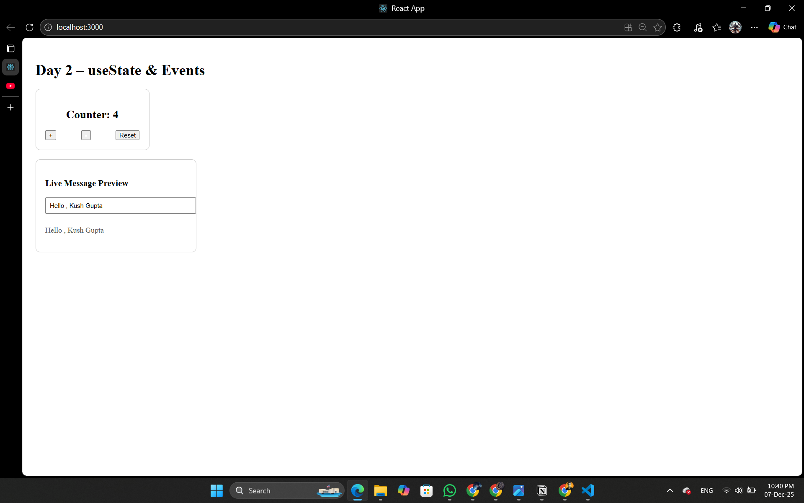

# Day 2 – useState, Events & Controlled Inputs

## What I Learned
- What useState is and why React uses it
- How state updates cause re-renders
- How to handle events like onClick and onChange
- What controlled inputs are and why they are important
- How to sync UI with state

## Projects Built
1. Counter Component
2. Live Message Preview Input

## Concepts Practiced
- Updating state
- Handling events
- Controlled components
- Dynamic UI rendering

## ScreenShot

