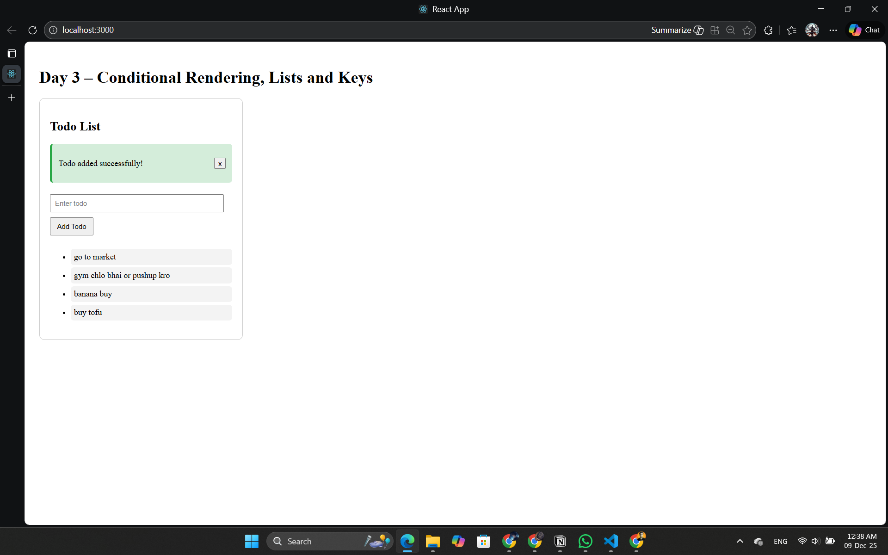

# Day 3 – Conditional Rendering, Lists, Keys & Reusable Components

## What I Learned
### Conditional Rendering:
- Show or hide UI based on a condition.
- Helps create dynamic interfaces like loading states, empty lists, popups.

### Lists & Keys:
- Used .map() to render multiple items.
- Keys help React track each list item efficiently.
- Keys must be unique and stable.

### Reusable Components:
- Built a reusable Alert component.
- Reusability reduces duplication and maintains clean architecture.

## Projects Built
1. Todo List (basic)
2. Reusable Alert component

## Concepts Practiced
- Conditional UI
- Lists, map(), keys
- Component composition
- Reusability patterns

## ScreenShot

