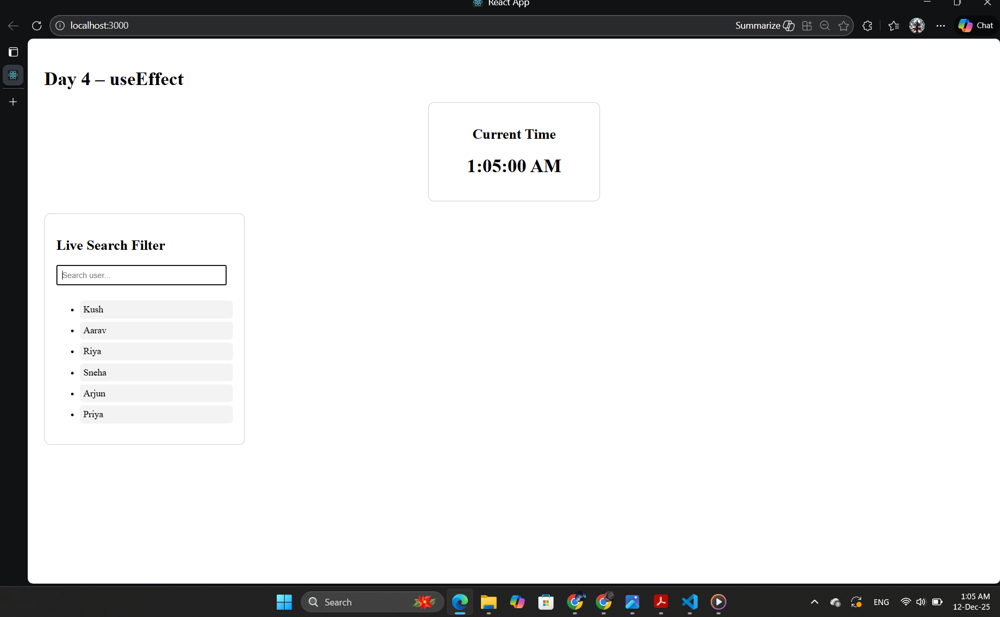
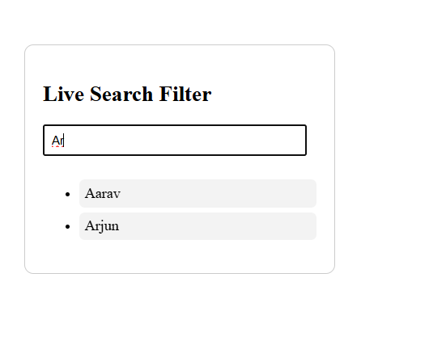

# Day 4 – useEffect Deep Dive

## What I Learned
### useEffect Basics:
- useEffect lets us run side effects after the component renders.
- It is used for tasks like data fetching, timers, event listeners, and syncing state.

### Dependency Array:
- `[]` → runs once when component loads.
- `[value]` → runs whenever value changes.
- No array → runs on every render (rarely used).

### Cleanup Function:
- Used to remove timers, listeners, or subscriptions.
- Prevents memory leaks.

## Projects Built
1. **Digital Clock**
   - Updated time every second using setInterval.
   - Cleaned up interval to avoid memory issues.
2. **Live Search Filter**
   - useEffect ran whenever search input changed.
   - Filtered list dynamically based on search text.

## Concepts Practiced
- Timers with cleanup
- Controlled inputs
- Filtering lists
- Dependency-based useEffect
- Conditional rendering

## ScreenShots

